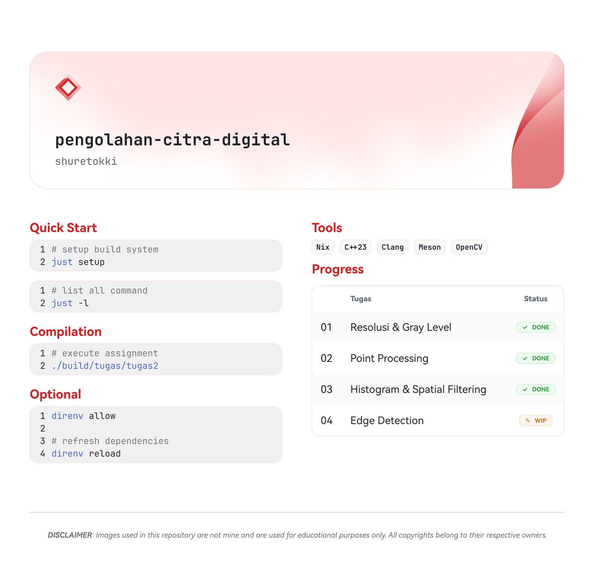

<picture>
  <source media="(prefers-color-scheme: dark)" srcset="common/assets/readme-dark.png">
  <source media="(prefers-color-scheme: light)" srcset="common/assets/readme-light.png">
  
</picture>