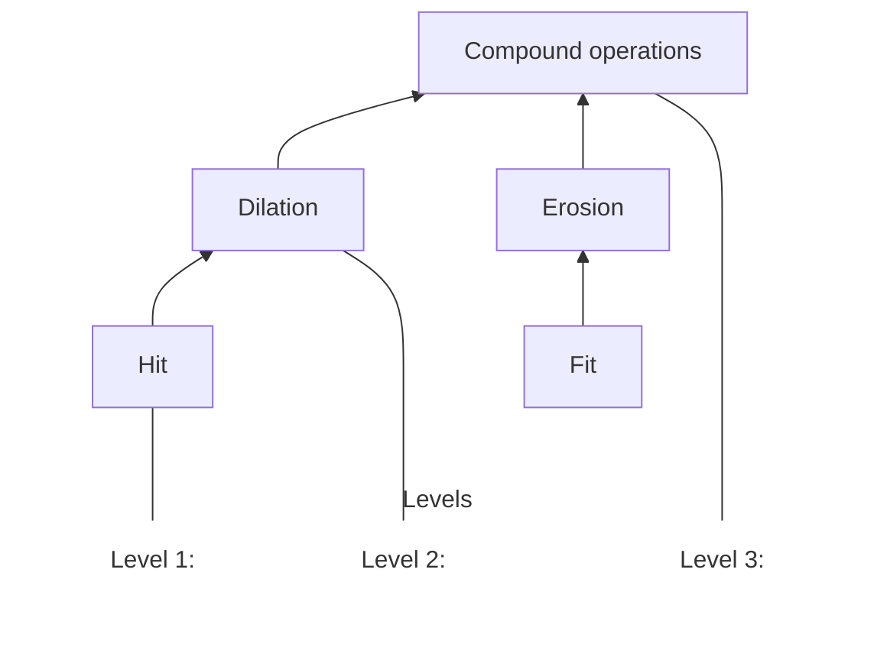
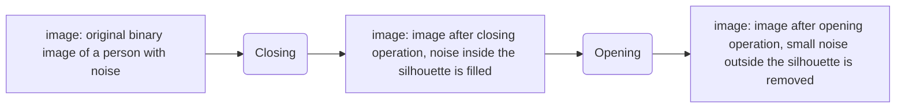

# Morfologi Citra

2

# Morfologi Citra

* Apa yang bisa dilakukan oleh morfologi citra ?

* Operasi morfologi :
    * Fit dan Hit
    * Erosi (Erosion)
    * Dilasi (Dilation)
    * Operasi Gabungan (Compound Operations)

3

# Kegunaan Morfologi

* Remove Noise
    - Small Objects

* Fill holes

4

# Kegunaan Morfologi

## 🞇 Isolate Objects

5

# Cara Kerja Morfologi Citra

* Konversi citra ke dalam bentuk Grayscale
* Lakukan binerisasi citra $\rightarrow$ Thresholding
* Morfologi

* Dapat juga diterapkan pada citra grayscale

6

# Hit dan Fit untuk Citra 1D

![Diagram showing an input image array [1, 0, 0, 0, 1, 1, 1, 0, 1, 1], a structuring element [1, 1, 1], and an output image array with a placeholder 0/1. Arrows indicate the process of applying the SE to the input image. Text "Desain SE sesuai keinginan" is next to the SE.](xkui)

**Hit: If just one of the '1's in the SE match with the input => output = 1, otherwise output = 0**

**Fit: If all '1's in the SE match with input => output = 1, otherwise output = 0**

7

# Dilasi (Dilation) berdasarkan Operasi Hit

**Input image**

**Structuring Element (SE)**

$$g(x) = f(x) \oplus SE$$

**Output Image**

**Hit: If just one of the '1's in the SE match with the input => output = 1, otherwise output = 0**

8

# Contoh Dilasi

![Diagram showing a dilation operation with an Input array, a Structuring Element (SE), and an Output array. The Input array is [1, 0, 0, 0, 1, 1, 1, 0, 1, 1]. The SE is [1, 1, 1]. The Output array shows the first two results as [EMPTY, 1, 0, EMPTY, EMPTY, EMPTY, EMPTY, EMPTY, EMPTY, EMPTY].](zszn)

<table>
  <tbody>
    <tr>
        <td>Input</td>
        <td>1</td>
        <td>0</td>
        <td>0</td>
        <td>0</td>
        <td>1</td>
        <td>1</td>
        <td>1</td>
        <td>0</td>
        <td>1</td>
        <td>1</td>
    </tr>
    <tr>
        <td> </td>
        <td>↓</td>
        <td> </td>
        <td> </td>
        <td> </td>
        <td> </td>
        <td> </td>
        <td> </td>
        <td> </td>
        <td> </td>
        <td> </td>
    </tr>
    <tr>
        <td>SE</td>
        <td> </td>
        <td>1</td>
        <td>1</td>
        <td>1</td>
        <td> </td>
        <td> </td>
        <td> </td>
        <td> </td>
        <td> </td>
        <td> </td>
    </tr>
    <tr>
        <td> </td>
        <td>↓</td>
        <td> </td>
        <td> </td>
        <td> </td>
        <td> </td>
        <td> </td>
        <td> </td>
        <td> </td>
        <td> </td>
        <td> </td>
    </tr>
    <tr>
        <td>Output</td>
        <td> </td>
        <td>1</td>
        <td>0</td>
        <td> </td>
        <td> </td>
        <td> </td>
        <td> </td>
        <td> </td>
        <td> </td>
        <td> </td>
    </tr>
  </tbody>
</table>

9

# Contoh Dilasi

<table>
  <tbody>
    <tr>
        <td>Input</td>
        <td>1</td>
        <td>0</td>
        <td>0</td>
        <td>0</td>
        <td>1</td>
        <td>1</td>
        <td>1</td>
        <td>0</td>
        <td>1</td>
        <td>1</td>
    </tr>
    <tr>
        <td> </td>
        <td> </td>
        <td> </td>
        <td> </td>
        <td>↓</td>
        <td> </td>
        <td> </td>
        <td> </td>
        <td> </td>
        <td> </td>
        <td> </td>
    </tr>
    <tr>
        <td>SE</td>
        <td> </td>
        <td> </td>
        <td> </td>
        <td>1</td>
        <td>1</td>
        <td>1</td>
        <td> </td>
        <td> </td>
        <td> </td>
        <td> </td>
    </tr>
    <tr>
        <td> </td>
        <td> </td>
        <td> </td>
        <td> </td>
        <td>↓</td>
        <td> </td>
        <td> </td>
        <td> </td>
        <td> </td>
        <td> </td>
        <td> </td>
    </tr>
    <tr>
        <td>Output</td>
        <td> </td>
        <td>1</td>
        <td>0</td>
        <td>1</td>
        <td> </td>
        <td> </td>
        <td> </td>
        <td> </td>
        <td> </td>
        <td> </td>
    </tr>
  </tbody>
</table>

10

# Contoh Dilasi

**Input**
<table>
  <tbody>
    <tr>
        <td>1</td>
        <td>0</td>
        <td>0</td>
        <td>0</td>
        <td>1</td>
        <td>1</td>
        <td>1</td>
        <td>0</td>
        <td>1</td>
        <td>1</td>
    </tr>
  </tbody>
</table>

**SE**
<table>
  <tbody>
    <tr>
        <td>1</td>
        <td>1</td>
        <td>1</td>
    </tr>
  </tbody>
</table>

**Output**
<table>
  <tbody>
    <tr>
        <td> </td>
        <td>1</td>
        <td>0</td>
        <td>1</td>
        <td>1</td>
        <td> </td>
        <td> </td>
        <td> </td>
        <td> </td>
        <td> </td>
    </tr>
  </tbody>
</table>

11

# Contoh Dilasi

**Input**
<table>
  <tbody>
    <tr>
        <td>1</td>
        <td>0</td>
        <td>0</td>
        <td>0</td>
        <td>1</td>
        <td>1</td>
        <td>1</td>
        <td>0</td>
        <td>1</td>
        <td>1</td>
    </tr>
  </tbody>
</table>

**SE**
<table>
  <tbody>
    <tr>
        <td> </td>
        <td> </td>
        <td> </td>
        <td> </td>
        <td>1</td>
        <td>1</td>
        <td>1</td>
        <td> </td>
        <td> </td>
        <td> </td>
    </tr>
  </tbody>
</table>

**Output**
<table>
  <tbody>
    <tr>
        <td> </td>
        <td>1</td>
        <td>0</td>
        <td>1</td>
        <td>1</td>
        <td>1</td>
        <td> </td>
        <td> </td>
        <td> </td>
        <td> </td>
    </tr>
  </tbody>
</table>

12

# Contoh Dilasi

**Input**
<table>
  <tbody>
    <tr>
        <td>1</td>
        <td>0</td>
        <td>0</td>
        <td>0</td>
        <td>1</td>
        <td>1</td>
        <td>1</td>
        <td>0</td>
        <td>1</td>
        <td>1</td>
    </tr>
  </tbody>
</table>

**SE**
<table>
  <tbody>
    <tr>
        <td>1</td>
        <td>1</td>
        <td>1</td>
    </tr>
  </tbody>
</table>

**Output**
<table>
  <tbody>
    <tr>
        <td> </td>
        <td>1</td>
        <td>0</td>
        <td>1</td>
        <td>1</td>
        <td>1</td>
        <td>1</td>
        <td> </td>
        <td> </td>
        <td> </td>
    </tr>
  </tbody>
</table>

13

# Contoh Dilasi

**Input**
<table>
  <tbody>
    <tr>
        <td>1</td>
        <td>0</td>
        <td>0</td>
        <td>0</td>
        <td>1</td>
        <td>1</td>
        <td>1</td>
        <td>0</td>
        <td>1</td>
        <td>1</td>
    </tr>
  </tbody>
</table>

**SE**
<table>
  <tbody>
    <tr>
        <td>1</td>
        <td>1</td>
        <td>1</td>
    </tr>
  </tbody>
</table>

**Output**
<table>
  <tbody>
    <tr>
        <td> </td>
        <td>1</td>
        <td>0</td>
        <td>1</td>
        <td>1</td>
        <td>1</td>
        <td>1</td>
        <td>1</td>
        <td> </td>
        <td> </td>
    </tr>
  </tbody>
</table>

14

# Contoh Dilasi

**Input**
<table>
  <tbody>
    <tr>
        <td>1</td>
        <td>0</td>
        <td>0</td>
        <td>0</td>
        <td>1</td>
        <td>1</td>
        <td>1</td>
        <td>0</td>
        <td>1</td>
        <td>1</td>
    </tr>
  </tbody>
</table>

**SE**
<table>
  <tbody>
    <tr>
        <td>1</td>
        <td>1</td>
        <td>1</td>
    </tr>
  </tbody>
</table>

**Output**
<table>
  <tbody>
    <tr>
        <td> </td>
        <td>1</td>
        <td>0</td>
        <td>1</td>
        <td>1</td>
        <td>1</td>
        <td>1</td>
        <td>1</td>
        <td>1</td>
        <td> </td>
    </tr>
  </tbody>
</table>

**Object (1) menjadi lebih besar dan holes (0) menjadi terisi dengan object atau hilang**

15

# Erosi (Erosion) berdasarkan Operasi Fit

![Diagram showing the erosion process on a 1D binary image using a structuring element. An input image array [1, 0, 0, 0, 1, 1, 1, 0, 1, 1] is processed by a structuring element [1, 1, 1]. The formula g(x) = f(x) ⊖ SE is shown. The output image shows a '0' at the second position, illustrating the 'Fit' operation.](zjfn)

$$g(x) = f(x) \ominus SE$$

**Fit: If all '1's in the SE match with input => output = 1, otherwise output = 0**

16

# Contoh Erosi

<table>
  <tbody>
    <tr>
        <td>Input</td>
        <td>1</td>
        <td>0</td>
        <td>0</td>
        <td>0</td>
        <td>1</td>
        <td>1</td>
        <td>1</td>
        <td>0</td>
        <td>1</td>
        <td>1</td>
    </tr>
    <tr>
        <td>SE</td>
        <td> </td>
        <td>1</td>
        <td>1</td>
        <td>1</td>
        <td> </td>
        <td> </td>
        <td> </td>
        <td> </td>
        <td> </td>
        <td> </td>
    </tr>
    <tr>
        <td>Output</td>
        <td> </td>
        <td>0</td>
        <td>0</td>
        <td> </td>
        <td> </td>
        <td> </td>
        <td> </td>
        <td> </td>
        <td> </td>
        <td> </td>
    </tr>
  </tbody>
</table>

17

# Contoh Erosi

**Input**
<table>
  <tbody>
    <tr>
        <td>1</td>
        <td>0</td>
        <td>0</td>
        <td>0</td>
        <td>1</td>
        <td>1</td>
        <td>1</td>
        <td>0</td>
        <td>1</td>
        <td>1</td>
    </tr>
  </tbody>
</table>

**SE**
<table>
  <tbody>
    <tr>
        <td>1</td>
        <td>1</td>
        <td>1</td>
    </tr>
  </tbody>
</table>

**Output**
<table>
  <tbody>
    <tr>
        <td> </td>
        <td>0</td>
        <td>0</td>
        <td>0</td>
        <td> </td>
        <td> </td>
        <td> </td>
        <td> </td>
        <td> </td>
        <td> </td>
    </tr>
  </tbody>
</table>

18

# Contoh Erosi

**Input**
<table>
  <tbody>
    <tr>
        <td>1</td>
        <td>0</td>
        <td>0</td>
        <td>0</td>
        <td>1</td>
        <td>1</td>
        <td>1</td>
        <td>0</td>
        <td>1</td>
        <td>1</td>
    </tr>
  </tbody>
</table>

**SE**
<table>
  <tbody>
    <tr>
        <td>1</td>
        <td>1</td>
        <td>1</td>
    </tr>
  </tbody>
</table>

**Output**
<table>
  <tbody>
    <tr>
        <td> </td>
        <td>0</td>
        <td>0</td>
        <td>0</td>
        <td>0</td>
        <td> </td>
        <td> </td>
        <td> </td>
        <td> </td>
        <td> </td>
    </tr>
  </tbody>
</table>

19

# Contoh Erosi

<table>
  <tbody>
    <tr>
        <td>Input</td>
        <td>1</td>
        <td>0</td>
        <td>0</td>
        <td>0</td>
        <td>1</td>
        <td>1</td>
        <td>1</td>
        <td>0</td>
        <td>1</td>
        <td>1</td>
    </tr>
    <tr>
        <td> </td>
        <td> </td>
        <td> </td>
        <td> </td>
        <td> </td>
        <td>↓</td>
        <td> </td>
        <td> </td>
        <td> </td>
        <td> </td>
        <td> </td>
    </tr>
    <tr>
        <td>SE</td>
        <td> </td>
        <td> </td>
        <td> </td>
        <td> </td>
        <td>1</td>
        <td>1</td>
        <td>1</td>
        <td> </td>
        <td> </td>
        <td> </td>
    </tr>
    <tr>
        <td> </td>
        <td> </td>
        <td> </td>
        <td> </td>
        <td> </td>
        <td>↓</td>
        <td> </td>
        <td> </td>
        <td> </td>
        <td> </td>
        <td> </td>
    </tr>
    <tr>
        <td>Output</td>
        <td> </td>
        <td>0</td>
        <td>0</td>
        <td>0</td>
        <td>0</td>
        <td>1</td>
        <td> </td>
        <td> </td>
        <td> </td>
        <td> </td>
    </tr>
  </tbody>
</table>

20

# Contoh Erosi

<table>
  <tbody>
    <tr>
        <td>Input</td>
        <td>1</td>
        <td>0</td>
        <td>0</td>
        <td>0</td>
        <td>1</td>
        <td>1</td>
        <td>1</td>
        <td>0</td>
        <td>1</td>
        <td>1</td>
    </tr>
    <tr>
        <td>SE</td>
        <td> </td>
        <td> </td>
        <td> </td>
        <td> </td>
        <td> </td>
        <td>1</td>
        <td>1</td>
        <td>1</td>
        <td> </td>
        <td> </td>
    </tr>
    <tr>
        <td>Output</td>
        <td> </td>
        <td>0</td>
        <td>0</td>
        <td>0</td>
        <td>0</td>
        <td>1</td>
        <td>0</td>
        <td> </td>
        <td> </td>
        <td> </td>
    </tr>
  </tbody>
</table>

Output

21

# Contoh Erosi

![Diagram showing an erosion operation on a 1D binary array. An input array [1, 0, 0, 0, 1, 1, 1, 0, 1, 1] is processed with a structuring element (SE) [1, 1, 1] to produce an output array [EMPTY, 0, 0, 0, 0, 1, 0, 0, EMPTY, EMPTY]. Yellow arrows indicate the flow from Input to SE and then to Output.](mcum)

<table>
  <tbody>
    <tr>
        <td>Input</td>
        <td>1</td>
        <td>0</td>
        <td>0</td>
        <td>0</td>
        <td>1</td>
        <td>1</td>
        <td>1</td>
        <td>0</td>
        <td>1</td>
        <td>1</td>
    </tr>
    <tr>
        <td>SE</td>
        <td> </td>
        <td> </td>
        <td> </td>
        <td> </td>
        <td> </td>
        <td> </td>
        <td>1</td>
        <td>1</td>
        <td>1</td>
        <td> </td>
    </tr>
    <tr>
        <td>Output</td>
        <td> </td>
        <td>0</td>
        <td>0</td>
        <td>0</td>
        <td>0</td>
        <td>1</td>
        <td>0</td>
        <td>0</td>
        <td> </td>
        <td> </td>
    </tr>
  </tbody>
</table>

22

# Contoh Erosi

<table>
  <tbody>
    <tr>
        <td>Input</td>
        <td>1</td>
        <td>0</td>
        <td>0</td>
        <td>0</td>
        <td>1</td>
        <td>1</td>
        <td>1</td>
        <td>0</td>
        <td>1</td>
        <td>1</td>
    </tr>
    <tr>
        <td>SE</td>
        <td> </td>
        <td> </td>
        <td> </td>
        <td> </td>
        <td> </td>
        <td> </td>
        <td>1</td>
        <td>1</td>
        <td>1</td>
        <td> </td>
    </tr>
    <tr>
        <td>Output</td>
        <td> </td>
        <td>0</td>
        <td>0</td>
        <td>0</td>
        <td>0</td>
        <td>1</td>
        <td>0</td>
        <td>0</td>
        <td>0</td>
        <td> </td>
    </tr>
  </tbody>
</table>

![Diagram showing the erosion process on a binary array. The Input array is [1, 0, 0, 0, 1, 1, 1, 0, 1, 1]. The Structuring Element (SE) is [1, 1, 1]. The resulting Output array is [0, 0, 0, 0, 1, 0, 0, 0], showing that the object (represented by 1s) has become smaller.](gbho)

**Object (1) menjadi lebih kecil**

23

# Morfologi Citra

* Structuring Elements (SE) dapat terdiri dari sebarang ukuran sesuai dengan kebutuhan
* Nilai dari elemen adalah **0** atau **1**, namun dimungkinkan memiliki nilai yang lain (termasuk tidak ada nilainya)
* Nilai kosong pada SE berarti bebas (*don't care*)

<table>
  <tbody>
    <tr>
        <td> </td>
        <td> </td>
        <td>1</td>
        <td>1</td>
        <td>1</td>
        <td> </td>
        <td> </td>
    </tr>
    <tr>
        <td> </td>
        <td>1</td>
        <td>1</td>
        <td>1</td>
        <td>1</td>
        <td>1</td>
        <td> </td>
    </tr>
    <tr>
        <td>1</td>
        <td>1</td>
        <td>1</td>
        <td>1</td>
        <td>1</td>
        <td>1</td>
        <td>1</td>
    </tr>
    <tr>
        <td>1</td>
        <td>1</td>
        <td>1</td>
        <td>①</td>
        <td>1</td>
        <td>1</td>
        <td>1</td>
    </tr>
    <tr>
        <td>1</td>
        <td>1</td>
        <td>1</td>
        <td>1</td>
        <td>1</td>
        <td>1</td>
        <td>1</td>
    </tr>
    <tr>
        <td> </td>
        <td>1</td>
        <td>1</td>
        <td>1</td>
        <td>1</td>
        <td>1</td>
        <td> </td>
    </tr>
    <tr>
        <td> </td>
        <td> </td>
        <td>1</td>
        <td>1</td>
        <td>1</td>
        <td> </td>
        <td> </td>
    </tr>
  </tbody>
</table>

24

# Dilasi (2-Dimensi) $\leftarrow$ Hit

$$g(x, y) = f(x, y) \oplus SE$$

## Structuring Element

$\longrightarrow$

* Objects tergabung (holes terisi object)

* Sudut yang tajam dihaluskan

25

# Contoh Dilasi

<table>
  <tbody>
    <tr>
        <td> </td>
        <td> </td>
        <td>1</td>
        <td>1</td>
        <td>1</td>
        <td> </td>
        <td> </td>
    </tr>
    <tr>
        <td> </td>
        <td>1</td>
        <td>1</td>
        <td>1</td>
        <td>1</td>
        <td>1</td>
        <td> </td>
    </tr>
    <tr>
        <td>1</td>
        <td>1</td>
        <td>1</td>
        <td>1</td>
        <td>1</td>
        <td>1</td>
        <td>1</td>
    </tr>
    <tr>
        <td>1</td>
        <td>1</td>
        <td>1</td>
        <td>①</td>
        <td>1</td>
        <td>1</td>
        <td>1</td>
    </tr>
    <tr>
        <td>1</td>
        <td>1</td>
        <td>1</td>
        <td>1</td>
        <td>1</td>
        <td>1</td>
        <td>1</td>
    </tr>
    <tr>
        <td> </td>
        <td>1</td>
        <td>1</td>
        <td>1</td>
        <td>1</td>
        <td>1</td>
        <td> </td>
    </tr>
    <tr>
        <td> </td>
        <td> </td>
        <td>1</td>
        <td>1</td>
        <td>1</td>
        <td> </td>
        <td> </td>
    </tr>
  </tbody>
</table>

Structuring element:
disc => rounded corners

26

# Erosi (2-Dimensi) $\leftarrow$ Fit

$$g(x, y) = f(x, y) \ominus SE$$

## Structuring Element

<table>
  <tbody>
    <tr>
        <td>1</td>
        <td>1</td>
        <td>1</td>
    </tr>
    <tr>
        <td>1</td>
        <td>1</td>
        <td>1</td>
    </tr>
    <tr>
        <td>1</td>
        <td>1</td>
        <td>1</td>
    </tr>
  </tbody>
</table>

$\rightarrow$

* Objects menjadi lebih kecil

27

# Contoh Erosi

28

# Aplikasi Menghitung Koin

* Kesulitan menghitung koin pada gambar di bawah disebabkan tergabungnya object koin

* Solusi: Thresholding dan Erosi utk memisahkannya!

29

## Compound Operations

- Menggabungkan operasi Erosion dan Dilation kedalam level operasi yang lebih tinggi (more advanced)

- Mencari garis tepi (*outline*)

- *Opening*: mengisolasi objects dan menghilangkan object-object kecil (lebih baik daripada Erosion)

- *Closing*: mengisi holes pada citra (lebih baik daripada Dilation)

30

# Mencari garis tepi (outline)

* Operasi Dilasi (object menjadi lebih besar)
* Substraksi citra asal dengan citra hasil dilasi
* Didapatkan outline

31

# Opening

* Motivasi: menghilangkan object-object kecil TETAPI tetap mempertahankan ukuran aslinya
* Opening = Erosion + Dilation
        - Gunakan SE yang sama
        - Hampir sama dengan erosi tetapi tidak terlalu *destructive*
* Math:

$$f(x, y) \circ SE = (f(x, y) \ominus SE) \oplus SE$$

* Opening adalah *idempotent*: operasi opening yang diulang-ulang tidak memberikan dampak yang berkelanjutan!

32

# Contoh Opening

SE
<table>
  <tbody>
    <tr>
        <td>1</td>
        <td>1</td>
        <td>1</td>
    </tr>
    <tr>
        <td>1</td>
        <td>1</td>
        <td>1</td>
    </tr>
    <tr>
        <td>1</td>
        <td>1</td>
        <td>1</td>
    </tr>
  </tbody>
</table>

## Erosion &emsp;&emsp;&emsp;&emsp;&emsp;&emsp;&emsp;&emsp;&emsp;&emsp;&emsp;&emsp;&emsp;&emsp;&emsp;&emsp;&emsp;&emsp; Dilation

    

33

# Contoh Opening

* 9x3 and 3x9 Structuring Elements

34

# Contoh Opening

* Structuring Element: 11 pixel disc

    

(show: cell_colony, 3 x erosion, 3 x dilation)

35

# Closing

* Motivasi: Mengisi holes TETAPI tetap menjaga ukuran aslinya
* Opening = Dilation + Erosion
    - Gunakan SE yang sama
    - Hampir sama dengan dilasi tetapi tidak terlalu *destructive*
* Math:

$$f(x, y) \bullet SE = (f(x, y) \oplus SE) \ominus SE$$

* Closing adalah *idempotent*: operasi closing yang diulang-ulang tidak memberikan dampak yang berkelanjutan!

36

# Closing

🞇 Structuring element: 3x3 square

$\rightarrow$

37

# Contoh Closing

* Operasi Closing dengan 22 piksel disc
* Menutupi holes yang kecil

38

# Contoh Closing

* Improve segmentation
    1. Threshold
    2. Closing dengan ukuran 20 piksel disc

(show: blobs-holes, 1 x dilation, 1 x erosion)

39

# Kombinasi Opening dan Closing

40

# Kombinasi Opening dan Closing

**FIGURE 9.11**

(a) Noisy image.

(b) Structuring element.

(c) Eroded image.

(d) Opening of *A*.

(e) Dilation of the opening.

(f) Closing of the opening. (Original image for this example courtesy of the National Institute of Standards and Technology.)

41

## Ringkasan

* Morphology

* Fit and Hit operations

* Erosion (based on Fit): Make objects smaller

  * Separate objects, remove small objects (noise)

* Dilation (based on Hit): Make objects bigger

  * Remove holes in objects

* Compound operations

  * Finding the outlines of the objects

  * Opening (Erosion + Dilation)

    * As Erosion but less destructive

  * Closing (Dilation + Erosion)

    * As Dilation but less destructive

42

# Latihan

* Diberikan citra biner:
    * Dilation
    * Erosion
    * Closing
    * Opening
* Structuring element:

<table>
  <tbody>
    <tr>
        <td>0</td>
        <td>0</td>
        <td>0</td>
        <td>0</td>
        <td>0</td>
        <td>0</td>
        <td>0</td>
        <td>0</td>
        <td>0</td>
        <td>0</td>
    </tr>
    <tr>
        <td>0</td>
        <td>0</td>
        <td>0</td>
        <td>0</td>
        <td>0</td>
        <td>0</td>
        <td>0</td>
        <td>0</td>
        <td>0</td>
        <td>0</td>
    </tr>
    <tr>
        <td>0</td>
        <td>0</td>
        <td>1</td>
        <td>1</td>
        <td>0</td>
        <td>0</td>
        <td>1</td>
        <td>0</td>
        <td>0</td>
        <td>0</td>
    </tr>
    <tr>
        <td>0</td>
        <td>0</td>
        <td>0</td>
        <td>1</td>
        <td>1</td>
        <td>1</td>
        <td>1</td>
        <td>1</td>
        <td>0</td>
        <td>0</td>
    </tr>
    <tr>
        <td>0</td>
        <td>0</td>
        <td>1</td>
        <td>1</td>
        <td>1</td>
        <td>1</td>
        <td>1</td>
        <td>0</td>
        <td>0</td>
        <td>0</td>
    </tr>
    <tr>
        <td>0</td>
        <td>0</td>
        <td>1</td>
        <td>1</td>
        <td>1</td>
        <td>1</td>
        <td>0</td>
        <td>0</td>
        <td>0</td>
        <td>0</td>
    </tr>
    <tr>
        <td>0</td>
        <td>0</td>
        <td>1</td>
        <td>1</td>
        <td>1</td>
        <td>1</td>
        <td>1</td>
        <td>0</td>
        <td>0</td>
        <td>0</td>
    </tr>
    <tr>
        <td>0</td>
        <td>0</td>
        <td>0</td>
        <td>1</td>
        <td>1</td>
        <td>1</td>
        <td>1</td>
        <td>0</td>
        <td>0</td>
        <td>0</td>
    </tr>
    <tr>
        <td>0</td>
        <td>0</td>
        <td>0</td>
        <td>0</td>
        <td>0</td>
        <td>0</td>
        <td>0</td>
        <td>0</td>
        <td>0</td>
        <td>0</td>
    </tr>
    <tr>
        <td>0</td>
        <td>0</td>
        <td>0</td>
        <td>0</td>
        <td>0</td>
        <td>0</td>
        <td>0</td>
        <td>0</td>
        <td>0</td>
        <td>0</td>
    </tr>
  </tbody>
</table>
<table>
  <tbody>
    <tr>
        <td>1</td>
        <td>1</td>
        <td>1</td>
    </tr>
    <tr>
        <td>1</td>
        <td>1</td>
        <td>1</td>
    </tr>
    <tr>
        <td>1</td>
        <td>1</td>
        <td>1</td>
    </tr>
  </tbody>
</table>

# Thank You !